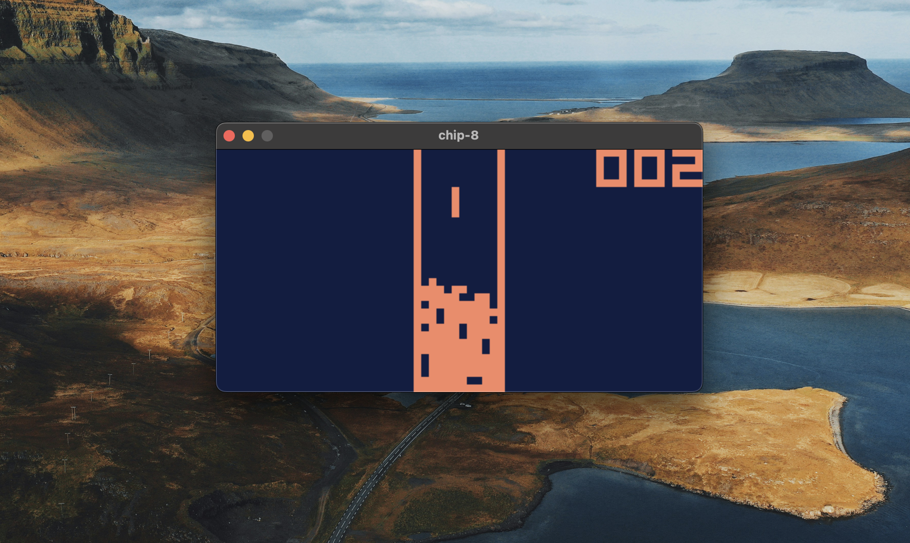

# CHIP-8
This is a CHIP-8 emulator written in Rust. 
It's not meant as a polished emulator and is very barebones at the moment.
You can load a ROM to play, and .. that's it :) No beeping or booping so far, only graphics.

It was meant for me to dip my toes in emulation and Rust.



## Building
You'll need to have SDL2 installed on your system. 
Here's a guide on how: https://github.com/Rust-SDL2/rust-sdl2

After you've installed SDL2, run:
```
cargo run -- <path-to-rom>
```

Here's a good start on finding some ROMs: https://github.com/kripod/chip8-roms

## Usage
A ROM file needs to be provided as the only argument, here's the usage printout:
```
CHIP-8

welcome to CHIP-8 ツ

No ROM path provided.
Usage: chip8 <path-to-rom>
```

## Keymapping
CHIP-8 has a 16x16 keypad layout. 
It's mapped onto a keyboard like so:
| 1 | 2 | 3 | 4 |
| Q | W | E | R |
| A | S | D | F |
| Z | X | C | V |

## Resources
These two pages were a huge help, basically all you need to build your own!
- https://tonisagrista.com/blog/2021/chip8-spec
- https://tobiasvl.github.io/blog/write-a-chip-8-emulator